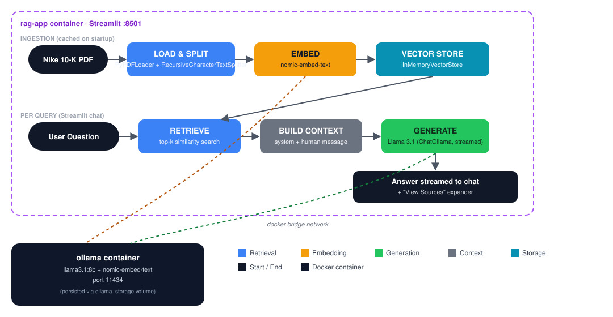
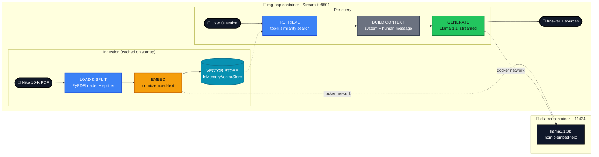

# 👟 Nike 10-K — Local RAG Agent


-000000?logo=ollama&logoColor=white)


A **fully local** RAG application that answers questions about Nike's 2023 10-K
filing. No cloud LLM calls, no API keys, no data leaving your machine —
everything runs through **Ollama** (Llama 3.1 for generation, Nomic for
embeddings), orchestrated with **LangChain** and served through a
**Streamlit** chat UI.

## 🔐 Privacy-first by design

- **100% local inference** — powered by Ollama, nothing ever leaves your machine
- **No third-party APIs** — no dependency on OpenAI, Anthropic, or any cloud LLM
- **Ideal for sensitive documents** — built for cases where cloud uploads aren't an option

## 🗺️ Architecture diagram

<p align="center">
  
</p>



1. **Ingestion** (runs once, cached via `st.cache_resource`) — load the PDF,
   split it into chunks, embed them with **Nomic** via Ollama, and hold them
   in an in-memory vector store.
2. **Retrieve** — on each question, pull the top-k most similar chunks.
3. **Build context** — assemble a system + human message pair grounded in
   those chunks.
4. **Generate** — **Llama 3.1** streams the answer token-by-token into the
   chat UI, with a "View Sources" expander showing exactly which chunks were used.

## 🧠 Two retrieval paths in this repo

- **`app.py` (the deployed Streamlit app)** — a straightforward retrieve →
  generate chain: `Retriever_tool_agent_setup.make_retriever_chain` does a
  similarity search, and the result is fed directly into `ChatOllama`.
- **`Retriever_tool_agent_setup.run_agent_demo`** (used from `main.py`) — an
  experimental **agentic** variant using LangChain's `create_agent` with a
  `dynamic_prompt` middleware that injects retrieved context per-turn.

## 🛠️ Tech stack

| Layer | Choice |
|---|---|
| LLM | Llama 3.1:8b (local, via Ollama) |
| Embeddings | Nomic-Embed-Text (local, via Ollama) |
| Orchestration | LangChain (`ChatOllama`, `OllamaEmbeddings`, agents) |
| Vector store | `InMemoryVectorStore` |
| UI | Streamlit |
| Deployment | Docker, Docker Compose, Docker Hub |

## 📦 Project structure

| File | Responsibility |
|------|-----------------|
| `Configuration.py` | `Settings` dataclass — model names, chunk size, paths |
| `Pipeline_steps.py` | Load PDF → split → build the vector store |
| `Retriever_tool_agent_setup.py` | Retriever chain, retrieval tool, and the agent demo |
| `main.py` | CLI entry point — runs the full pipeline + agent demo |
| `app.py` | Streamlit chat UI (the deployed app) |
| `nke-10k-2023.pdf` | Sample document — Nike's 2023 10-K filing |
| `Dockerfile` / `docker-compose.yml` | Container build + two-service orchestration (app + Ollama) |
| `setup.sh` | One-command Docker setup: pulls images and models |

## 🚀 Setup

### 🐳 Option A: Docker (recommended)

```bash
git clone https://github.com/xaqlayn/RAG_Agent.git
cd RAG_Agent
chmod +x setup.sh
./setup.sh
```

`setup.sh` starts the containers, waits for Ollama, and pulls `llama3.1:8b`
and `nomic-embed-text`. Then open [http://localhost:8501](http://localhost:8501).

<details>
<summary>Manual Docker steps</summary>

```bash
docker compose up -d
docker exec -it ollama ollama pull llama3.1:8b
docker exec -it ollama ollama pull nomic-embed-text
```

</details>

### 🐍 Option B: Local development

```bash
pip install -r requirements.txt

# make sure Ollama is running locally and pull the models
ollama pull llama3.1:8b
ollama pull nomic-embed-text

streamlit run app.py
```

## 🔧 Notable implementation details

- **Resource-constrained friendly** — runs on 8GB RAM using `python:3.11-slim`.
- **Service isolation** — Ollama and the Streamlit app run as separate
  containers, talking only over the internal Docker bridge network.
- **Grounded answers** — the system prompt explicitly instructs the model to
  say "I don't know" rather than hallucinate outside the retrieved context.

## 👨‍💻 Author

**Saqlain Majeed** — [GitHub](https://github.com/xaqlayn) · [Docker Hub](https://hub.docker.com/u/xack1122)
